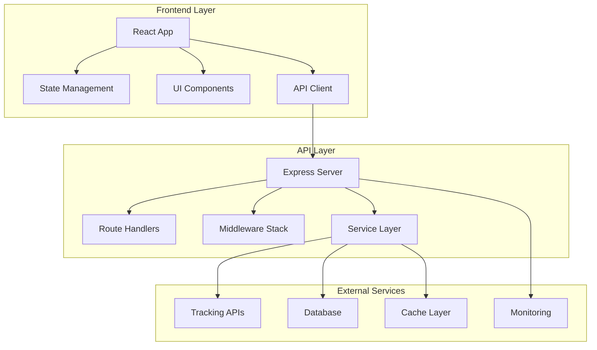
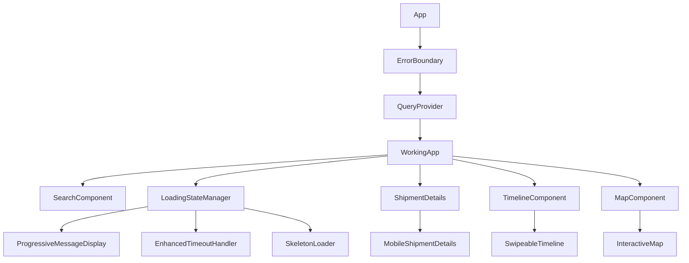

# Advanced Features Restoration - Design Document

## Overview

This design document outlines the systematic approach to restore and enhance the Shipping Tracker application from its current working basic state to a fully-featured, production-ready system. The design prioritizes incremental development, maintaining system stability at each step, and ensuring comprehensive testing throughout the process.

## Architecture

### System Architecture Overview



### Component Hierarchy



## Components and Interfaces

### 1. API Server Stabilization

#### Core API Structure
```typescript
interface APIServerConfig {
  server: ServerConfig;
  database: DatabaseConfig;
  redis: CacheConfig;
  security: SecurityConfig;
  apiProviders: APIProviderConfig[];
  monitoring: MonitoringConfig;
}

interface APIProviderConfig {
  name: string;
  apiKey?: string;
  baseUrl: string;
  enabled: boolean;
  tier: 'free' | 'freemium' | 'premium';
  rateLimit: number;
  timeout: number;
  retryConfig: RetryConfig;
}
```

#### Error Handling Strategy
- Graceful degradation when services are unavailable
- Comprehensive error logging and monitoring
- User-friendly error messages with actionable guidance
- Automatic fallback to demo/mock data when appropriate

### 2. API Integration and Aggregation

#### API Aggregator Service
```typescript
interface APIAggregator {
  searchTracking(trackingNumber: string, options?: SearchOptions): Promise<TrackingResult>;
  validateTrackingNumber(trackingNumber: string): ValidationResult;
  getProviderStatus(): ProviderStatus[];
  getCachedResult(trackingNumber: string): TrackingResult | null;
}

interface TrackingResult {
  trackingNumber: string;
  shipment: ShipmentTracking;
  sources: APIProviderResult[];
  confidence: number;
  lastUpdated: Date;
  cacheExpiry: Date;
}
```

#### Data Normalization
- Standardized data format across all API providers
- Intelligent merging of data from multiple sources
- Confidence scoring for data accuracy
- Conflict resolution strategies

### 3. Enhanced Loading States

#### Loading State Manager
```typescript
interface LoadingStateManager {
  startLoading(providers: APIProvider[]): void;
  updateProviderStatus(providerId: string, status: ProviderStatus): void;
  handleTimeout(timeoutMs: number): void;
  showFallbackOptions(): void;
  cancelLoading(): void;
}

interface ProviderStatus {
  id: string;
  name: string;
  status: 'pending' | 'active' | 'completed' | 'failed' | 'timeout';
  responseTime?: number;
  error?: string;
  progress: number;
}
```

#### Progressive Feedback Components
- Real-time provider status updates
- Timeout warnings and alternative options
- Interactive cancellation and retry mechanisms
- Contextual help and guidance

### 4. Advanced UI Components

#### Interactive Map Component
```typescript
interface MapComponent {
  route: ShipmentRoute;
  vesselPosition?: Coordinates;
  ports: Port[];
  onMarkerClick: (port: Port) => void;
  onRouteClick: (segment: RouteSegment) => void;
  zoomLevel: number;
  interactive: boolean;
}
```

#### Enhanced Timeline Component
```typescript
interface TimelineComponent {
  events: TimelineEvent[];
  currentStatus: string;
  completionPercentage: number;
  interactive: boolean;
  onEventClick: (event: TimelineEvent) => void;
  showProgress: boolean;
  compact: boolean;
}
```

#### Mobile-Optimized Components
- Touch gesture support (swipe, pinch, tap)
- Responsive layouts for all screen sizes
- Native mobile features integration
- Offline capability with service workers

### 5. State Management Architecture

#### Global State Structure
```typescript
interface AppState {
  tracking: TrackingState;
  ui: UIState;
  cache: CacheState;
  user: UserState;
}

interface TrackingState {
  currentShipment: ShipmentTracking | null;
  searchHistory: SearchHistoryItem[];
  favorites: FavoriteShipment[];
  isLoading: boolean;
  error: string | null;
}
```

#### Persistence Strategy
- Local storage for search history and preferences
- Session storage for temporary state
- IndexedDB for offline data caching
- URL state for shareable links

### 6. Error Handling and Resilience

#### Error Boundary Strategy
```typescript
interface ErrorBoundary {
  fallbackComponent: React.ComponentType<ErrorFallbackProps>;
  onError: (error: Error, errorInfo: ErrorInfo) => void;
  resetOnPropsChange: boolean;
  isolate: boolean;
}
```

#### Retry and Fallback Mechanisms
- Exponential backoff for API retries
- Circuit breaker pattern for failing services
- Graceful degradation to cached or demo data
- User-initiated recovery options

## Data Models

### Core Tracking Data Model
```typescript
interface ShipmentTracking {
  trackingNumber: string;
  trackingType: TrackingType;
  carrier: string;
  status: ShipmentStatus;
  estimatedDelivery?: Date;
  timeline: TimelineEvent[];
  route: ShipmentRoute;
  container?: ContainerInfo;
  vessel?: VesselInfo;
  metadata: TrackingMetadata;
}

interface TrackingMetadata {
  sources: string[];
  confidence: number;
  lastUpdated: Date;
  cacheExpiry: Date;
  version: string;
}
```

### API Response Normalization
```typescript
interface NormalizedAPIResponse {
  provider: string;
  rawData: any;
  normalizedData: Partial<ShipmentTracking>;
  confidence: number;
  processingTime: number;
  errors: string[];
}
```

## Error Handling

### Error Classification
1. **Network Errors**: Connection timeouts, DNS failures
2. **API Errors**: Rate limits, authentication failures, malformed responses
3. **Data Errors**: Invalid tracking numbers, missing data
4. **System Errors**: Database failures, cache issues
5. **User Errors**: Invalid input, unsupported operations

### Error Recovery Strategies
1. **Automatic Retry**: For transient network issues
2. **Fallback Data**: Use cached or demo data when APIs fail
3. **User Guidance**: Clear error messages with suggested actions
4. **Graceful Degradation**: Partial functionality when some services fail
5. **Error Reporting**: Automatic error reporting for system issues

## Testing Strategy

### Testing Pyramid
1. **Unit Tests**: Individual components and functions
2. **Integration Tests**: API endpoints and service interactions
3. **Component Tests**: React component behavior
4. **E2E Tests**: Complete user workflows
5. **Performance Tests**: Load testing and optimization
6. **Accessibility Tests**: WCAG compliance verification

### Test Coverage Goals
- 90%+ unit test coverage for critical business logic
- 80%+ integration test coverage for API endpoints
- 100% coverage for error handling paths
- Comprehensive E2E tests for all user workflows

## Performance Considerations

### Frontend Optimization
- Code splitting and lazy loading
- Image optimization and responsive images
- Service worker for offline functionality
- Bundle size optimization
- React performance optimizations (memo, useMemo, useCallback)

### Backend Optimization
- API response caching
- Database query optimization
- Connection pooling
- Rate limiting and throttling
- Horizontal scaling preparation

### Monitoring and Metrics
- Core Web Vitals tracking
- API response time monitoring
- Error rate tracking
- User experience metrics
- System resource monitoring

## Security Considerations

### API Security
- API key management and rotation
- Rate limiting and DDoS protection
- Input validation and sanitization
- CORS configuration
- Security headers implementation

### Data Protection
- Sensitive data encryption
- PII handling compliance
- Secure data transmission
- Access logging and auditing
- Data retention policies

## Deployment Strategy

### Incremental Rollout Plan
1. **Phase 1**: API server stabilization
2. **Phase 2**: Basic UI component restoration
3. **Phase 3**: Advanced loading states
4. **Phase 4**: Interactive components (map, timeline)
5. **Phase 5**: Mobile optimization
6. **Phase 6**: Advanced features (analytics, export)
7. **Phase 7**: Performance optimization
8. **Phase 8**: Production hardening

### Environment Management
- Development environment with mock data
- Staging environment with real API integration
- Production environment with full monitoring
- Feature flags for gradual feature rollout