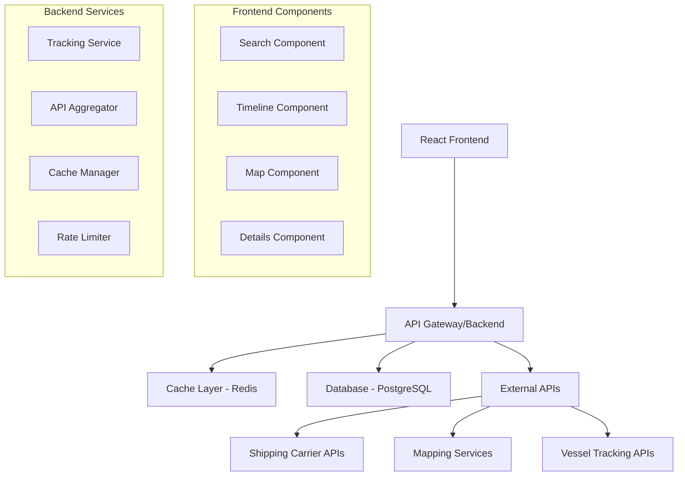

# Design Document

## Overview

The shipping tracking application will be built as a modern, responsive web application using React and TypeScript. The architecture follows a client-server pattern with a React frontend consuming RESTful APIs from a Node.js backend. The application prioritizes user experience with real-time tracking updates, interactive visualizations, and seamless cross-device functionality.

The design emphasizes modularity, scalability, and maintainability while ensuring optimal performance through caching strategies, code splitting, and efficient API management. The system integrates with multiple shipping carrier APIs to provide comprehensive tracking coverage.

## Architecture

### High-Level Architecture



### Technology Stack

**Frontend:**
- React 18 with TypeScript
- Tailwind CSS for styling
- Zustand for state management
- React Query for API state management
- Leaflet/Mapbox for mapping
- Framer Motion for animations

**Backend:**
- Node.js with Express.js
- TypeScript
- PostgreSQL for data persistence
- Redis for caching and session management
- Bull Queue for background jobs

**Infrastructure:**
- Vercel/Netlify for frontend hosting
- Railway/Render for backend hosting
- Cloudflare for CDN and security

## Components and Interfaces

### Frontend Components

#### SearchComponent
```typescript
interface SearchComponentProps {
  onSearch: (query: string, type: TrackingType) => void;
  isLoading: boolean;
  recentSearches: string[];
}

interface SearchState {
  query: string;
  detectedType: TrackingType | null;
  validationError: string | null;
}
```

**Responsibilities:**
- Input validation and format detection
- Auto-complete with search history
- Real-time format validation
- Search type detection (booking, container, BOL)

#### TimelineComponent
```typescript
interface TimelineComponentProps {
  events: TimelineEvent[];
  currentStatus: string;
  completionPercentage: number;
}

interface TimelineEvent {
  id: string;
  timestamp: Date;
  status: string;
  location: string;
  description: string;
  isCompleted: boolean;
  isCurrentStatus: boolean;
}
```

**Responsibilities:**
- Visual timeline rendering
- Status progression display
- Progress percentage calculation
- Responsive timeline layout

#### MapComponent
```typescript
interface MapComponentProps {
  route: RouteInfo;
  vesselPosition?: VesselPosition;
  ports: Port[];
  onMarkerClick: (location: Location) => void;
}

interface RouteInfo {
  origin: Port;
  destination: Port;
  intermediateStops: Port[];
  routePath: LatLng[];
}
```

**Responsibilities:**
- Interactive map rendering
- Route visualization
- Vessel position tracking
- Port information display

#### ShipmentDetailsComponent
```typescript
interface ShipmentDetailsProps {
  shipment: ShipmentData;
  isLoading: boolean;
  error: string | null;
}

interface ShipmentData {
  trackingNumber: string;
  carrier: string;
  service: ServiceType;
  vessel: VesselInfo;
  containers: Container[];
  timeline: TimelineEvent[];
  route: RouteInfo;
}
```

**Responsibilities:**
- Shipment information display
- Container details presentation
- Vessel information rendering
- Document links management

### Backend Services

#### TrackingService
```typescript
interface TrackingService {
  trackShipment(trackingNumber: string, type: TrackingType): Promise<ShipmentData>;
  getTrackingHistory(trackingNumber: string): Promise<TimelineEvent[]>;
  refreshTrackingData(trackingNumber: string): Promise<ShipmentData>;
}
```

**Responsibilities:**
- Coordinate API calls to multiple carriers
- Data normalization and aggregation
- Cache management
- Error handling and fallback logic

#### APIAggregator
```typescript
interface APIAggregator {
  fetchFromMultipleSources(trackingNumber: string): Promise<RawTrackingData[]>;
  prioritizeDataSources(data: RawTrackingData[]): ShipmentData;
  handleAPIFailures(errors: APIError[]): void;
}
```

**Responsibilities:**
- Multiple API integration
- Data source prioritization
- Fallback mechanism implementation
- Rate limit management

## Data Models

### Core Data Structures

```typescript
// Primary shipment tracking data
interface ShipmentTracking {
  id: string;
  trackingNumber: string;
  trackingType: 'booking' | 'container' | 'bol';
  carrier: string;
  service: 'FCL' | 'LCL';
  status: ShipmentStatus;
  timeline: TimelineEvent[];
  route: RouteInfo;
  containers: Container[];
  vessel: VesselInfo;
  lastUpdated: Date;
  dataSource: string;
}

// Timeline event structure
interface TimelineEvent {
  id: string;
  timestamp: Date;
  status: string;
  location: string;
  description: string;
  isCompleted: boolean;
  coordinates?: LatLng;
}

// Container information
interface Container {
  number: string;
  size: '20ft' | '40ft' | '45ft';
  type: 'GP' | 'HC' | 'RF' | 'OT';
  sealNumber: string;
  weight?: number;
  dimensions?: Dimensions;
}

// Vessel information
interface VesselInfo {
  name: string;
  imo: string;
  voyage: string;
  currentPosition?: LatLng;
  eta?: Date;
  ata?: Date;
}

// Route information
interface RouteInfo {
  origin: Port;
  destination: Port;
  intermediateStops: Port[];
  estimatedTransitTime: number;
  actualTransitTime?: number;
}

// Port information
interface Port {
  code: string;
  name: string;
  city: string;
  country: string;
  coordinates: LatLng;
  timezone: string;
}
```

### Database Schema

```sql
-- Shipments table for caching tracking data
CREATE TABLE shipments (
  id UUID PRIMARY KEY DEFAULT gen_random_uuid(),
  tracking_number VARCHAR(50) NOT NULL,
  tracking_type VARCHAR(20) NOT NULL,
  carrier VARCHAR(100),
  service VARCHAR(10),
  status VARCHAR(50),
  data JSONB NOT NULL,
  last_updated TIMESTAMP DEFAULT NOW(),
  expires_at TIMESTAMP,
  created_at TIMESTAMP DEFAULT NOW()
);

-- Search history for user experience
CREATE TABLE search_history (
  id UUID PRIMARY KEY DEFAULT gen_random_uuid(),
  tracking_number VARCHAR(50) NOT NULL,
  search_count INTEGER DEFAULT 1,
  last_searched TIMESTAMP DEFAULT NOW(),
  user_session VARCHAR(100)
);

-- API usage tracking for rate limiting
CREATE TABLE api_usage (
  id UUID PRIMARY KEY DEFAULT gen_random_uuid(),
  api_provider VARCHAR(50) NOT NULL,
  endpoint VARCHAR(200),
  requests_count INTEGER DEFAULT 1,
  window_start TIMESTAMP DEFAULT NOW(),
  rate_limit_remaining INTEGER
);
```

## Error Handling

### Error Categories and Responses

#### API Integration Errors
```typescript
interface APIError {
  provider: string;
  errorType: 'RATE_LIMIT' | 'NOT_FOUND' | 'TIMEOUT' | 'INVALID_RESPONSE';
  message: string;
  retryAfter?: number;
}

class TrackingErrorHandler {
  handleAPIError(error: APIError): ErrorResponse {
    switch (error.errorType) {
      case 'RATE_LIMIT':
        return this.handleRateLimit(error);
      case 'NOT_FOUND':
        return this.handleNotFound(error);
      case 'TIMEOUT':
        return this.handleTimeout(error);
      default:
        return this.handleGenericError(error);
    }
  }
}
```

#### User-Facing Error Messages
- **Tracking Not Found**: "We couldn't find tracking information for this number. Please verify the tracking number and try again."
- **API Unavailable**: "Our tracking service is temporarily unavailable. We're trying alternative sources..."
- **Network Error**: "Connection issue detected. Please check your internet connection and try again."
- **Rate Limited**: "Too many requests. Please wait a moment before searching again."

#### Fallback Strategies
1. **Primary API Failure**: Automatically try secondary APIs
2. **All APIs Down**: Show cached data with timestamp
3. **Partial Data**: Display available information with warnings
4. **Complete Failure**: Provide manual tracking links to carrier websites

## Testing Strategy

### Frontend Testing

#### Unit Testing
- Component rendering tests using React Testing Library
- Hook functionality tests
- Utility function tests
- State management tests

```typescript
// Example component test
describe('SearchComponent', () => {
  it('should detect container number format', () => {
    render(<SearchComponent onSearch={mockOnSearch} />);
    const input = screen.getByRole('textbox');
    fireEvent.change(input, { target: { value: 'ABCD1234567' } });
    expect(screen.getByText('Container Number detected')).toBeInTheDocument();
  });
});
```

#### Integration Testing
- API integration tests
- Component interaction tests
- User flow tests
- Error handling tests

#### End-to-End Testing
- Complete user journeys using Playwright
- Cross-browser compatibility tests
- Mobile responsiveness tests
- Performance tests

### Backend Testing

#### Unit Testing
- Service layer tests
- API integration tests
- Data transformation tests
- Error handling tests

```typescript
// Example service test
describe('TrackingService', () => {
  it('should aggregate data from multiple APIs', async () => {
    const mockData = [mockAPI1Response, mockAPI2Response];
    jest.spyOn(apiAggregator, 'fetchFromMultipleSources').mockResolvedValue(mockData);
    
    const result = await trackingService.trackShipment('TEST123', 'container');
    expect(result.timeline).toHaveLength(5);
    expect(result.carrier).toBe('Maersk');
  });
});
```

#### API Testing
- External API integration tests
- Rate limiting tests
- Fallback mechanism tests
- Data validation tests

#### Performance Testing
- Load testing with Artillery
- Database query optimization tests
- Cache performance tests
- Memory usage monitoring

### Testing Automation

#### CI/CD Pipeline
```yaml
# GitHub Actions workflow
name: Test and Deploy
on: [push, pull_request]
jobs:
  test:
    runs-on: ubuntu-latest
    steps:
      - uses: actions/checkout@v3
      - name: Setup Node.js
        uses: actions/setup-node@v3
        with:
          node-version: '18'
      - name: Install dependencies
        run: npm ci
      - name: Run unit tests
        run: npm run test:unit
      - name: Run integration tests
        run: npm run test:integration
      - name: Run E2E tests
        run: npm run test:e2e
```

#### Quality Gates
- Minimum 80% code coverage
- All tests must pass
- No critical security vulnerabilities
- Performance benchmarks met
- Accessibility standards compliance

### Monitoring and Observability

#### Application Monitoring
- Error tracking with Sentry
- Performance monitoring with Web Vitals
- User analytics with privacy-focused tools
- API usage and rate limit monitoring

#### Alerting Strategy
- Critical errors: Immediate notification
- API failures: 5-minute delay notification
- Performance degradation: 15-minute delay notification
- Rate limit warnings: Daily summary

This design provides a solid foundation for building a scalable, maintainable shipping tracking application that meets all the specified requirements while ensuring excellent user experience and system reliability.