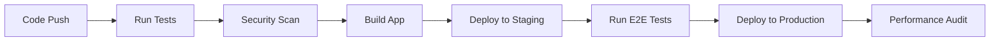

# Deployment Guide

This document provides comprehensive instructions for deploying the Shipping Tracker application to various environments.

## Table of Contents

- [Prerequisites](#prerequisites)
- [Environment Configuration](#environment-configuration)
- [Deployment Methods](#deployment-methods)
- [CI/CD Pipeline](#cicd-pipeline)
- [Monitoring and Analytics](#monitoring-and-analytics)
- [Security Considerations](#security-considerations)
- [Troubleshooting](#troubleshooting)

## Prerequisites

### Required Tools

- Node.js 18+ 
- pnpm 8+
- Docker (for containerized deployment)
- Vercel CLI (for Vercel deployment)

### Installation

```bash
# Install Node.js (using nvm)
nvm install 18
nvm use 18

# Install pnpm
npm install -g pnpm

# Install Vercel CLI
npm install -g vercel

# Install Docker
# Follow instructions at https://docs.docker.com/get-docker/
```

## Environment Configuration

### Environment Variables

Create `.env` files for different environments:

#### `.env.staging`
```env
VITE_API_BASE_URL=https://api-staging.shipping-tracker.com
VITE_ENABLE_ANALYTICS=false
VITE_ENABLE_ERROR_TRACKING=true
VITE_USE_MOCK_API=false
```

#### `.env.production`
```env
VITE_API_BASE_URL=https://api.shipping-tracker.com
VITE_ENABLE_ANALYTICS=true
VITE_ENABLE_ERROR_TRACKING=true
VITE_USE_MOCK_API=false
```

### Vercel Environment Variables

Set these in your Vercel dashboard:

- `VITE_API_BASE_URL`
- `VITE_ENABLE_ANALYTICS`
- `VITE_ENABLE_ERROR_TRACKING`

## Deployment Methods

### 1. Vercel Deployment (Recommended)

#### Automatic Deployment

The application is configured for automatic deployment via GitHub Actions:

- **Staging**: Deploys automatically on push to `develop` branch
- **Production**: Deploys automatically on push to `main` branch

#### Manual Deployment

```bash
# Deploy to staging
pnpm deploy:staging

# Deploy to production
pnpm deploy:production
```

#### Direct Vercel CLI

```bash
# Login to Vercel
vercel login

# Deploy to preview
vercel

# Deploy to production
vercel --prod
```

### 2. Docker Deployment

#### Build Docker Image

```bash
# Build the image
pnpm docker:build

# Run locally
pnpm docker:run

# Or use docker-compose
pnpm docker:compose
```

#### Production Docker Deployment

```bash
# Build for production
docker build -t shipping-tracker:production .

# Run with environment variables
docker run -p 8080:8080 \
  -e NODE_ENV=production \
  -e VITE_API_BASE_URL=https://api.shipping-tracker.com \
  shipping-tracker:production
```

### 3. Static Hosting (Netlify, AWS S3, etc.)

```bash
# Build the application
pnpm build

# Upload the dist/ folder to your static hosting provider
```

## CI/CD Pipeline

### GitHub Actions Workflow

The CI/CD pipeline includes:

1. **Testing**: Unit tests, integration tests, type checking
2. **Security Scanning**: Vulnerability scanning with Trivy
3. **Building**: Application build with optimization
4. **Deployment**: Automatic deployment to staging/production
5. **Performance Monitoring**: Lighthouse audits

### Pipeline Stages



### Required Secrets

Set these in your GitHub repository secrets:

- `VERCEL_TOKEN`: Vercel deployment token
- `VERCEL_ORG_ID`: Vercel organization ID
- `VERCEL_PROJECT_ID`: Vercel project ID
- `CODECOV_TOKEN`: Code coverage reporting token

## Monitoring and Analytics

### Performance Monitoring

The application includes built-in performance monitoring:

- **Web Vitals**: Core Web Vitals tracking
- **Error Tracking**: Automatic error capture and reporting
- **User Analytics**: User interaction tracking (production only)

### Health Checks

- **Application Health**: `/health` endpoint
- **Service Worker**: Offline capability monitoring
- **Performance Metrics**: Real-time performance tracking

### Monitoring Services Integration

Configure these services for production monitoring:

1. **Error Tracking**: Sentry, Bugsnag, or LogRocket
2. **Analytics**: Google Analytics, Mixpanel, or Amplitude
3. **Performance**: New Relic, DataDog, or custom monitoring

## Security Considerations

### Security Headers

The application includes comprehensive security headers:

- Content Security Policy (CSP)
- X-Frame-Options
- X-Content-Type-Options
- X-XSS-Protection
- Referrer-Policy

### Rate Limiting

Built-in rate limiting for:

- API requests: 10 requests per minute
- General requests: 100 requests per minute

### Input Validation

All user inputs are sanitized and validated:

- Tracking number sanitization
- XSS prevention
- SQL injection prevention

## Troubleshooting

### Common Issues

#### Build Failures

```bash
# Clear cache and reinstall
rm -rf node_modules pnpm-lock.yaml
pnpm install

# Check for TypeScript errors
pnpm type-check

# Run tests
pnpm test:run
```

#### Deployment Failures

```bash
# Check environment variables
echo $VITE_API_BASE_URL

# Verify build output
ls -la dist/

# Check deployment logs
vercel logs
```

#### Performance Issues

```bash
# Analyze bundle size
pnpm build:analyze

# Run Lighthouse audit
npx lighthouse https://your-app-url.com --view
```

### Debug Mode

Enable debug mode for troubleshooting:

```bash
# Set debug environment variable
export DEBUG=shipping-tracker:*

# Run with verbose logging
pnpm dev --debug
```

### Support

For deployment issues:

1. Check the [GitHub Issues](https://github.com/your-org/shipping-tracker/issues)
2. Review deployment logs
3. Contact the development team

## Performance Optimization

### Build Optimization

The application includes several performance optimizations:

- **Code Splitting**: Automatic route-based code splitting
- **Tree Shaking**: Unused code elimination
- **Compression**: Gzip and Brotli compression
- **Caching**: Aggressive caching strategies
- **Image Optimization**: Automatic image optimization

### Runtime Optimization

- **Service Worker**: Offline caching and background sync
- **Virtual Scrolling**: Efficient large list rendering
- **Memoization**: Component and computation memoization
- **Lazy Loading**: On-demand resource loading

### Monitoring Performance

```bash
# Run performance audit
npm run lighthouse

# Analyze bundle
npm run analyze

# Check Core Web Vitals
# Use browser dev tools or web.dev/measure
```

## Rollback Procedures

### Vercel Rollback

```bash
# List deployments
vercel ls

# Rollback to previous deployment
vercel rollback [deployment-url]
```

### Docker Rollback

```bash
# List images
docker images shipping-tracker

# Run previous version
docker run -p 8080:8080 shipping-tracker:previous-tag
```

### Emergency Rollback

In case of critical issues:

1. Immediately rollback to last known good version
2. Investigate the issue in staging environment
3. Apply hotfix and redeploy
4. Post-mortem analysis

## Maintenance

### Regular Tasks

- **Dependency Updates**: Monthly security updates
- **Performance Audits**: Weekly Lighthouse audits
- **Security Scans**: Automated daily scans
- **Backup Verification**: Weekly backup tests

### Monitoring Checklist

- [ ] Application health endpoints responding
- [ ] Error rates within acceptable limits
- [ ] Performance metrics meeting targets
- [ ] Security headers properly configured
- [ ] SSL certificates valid and up to date